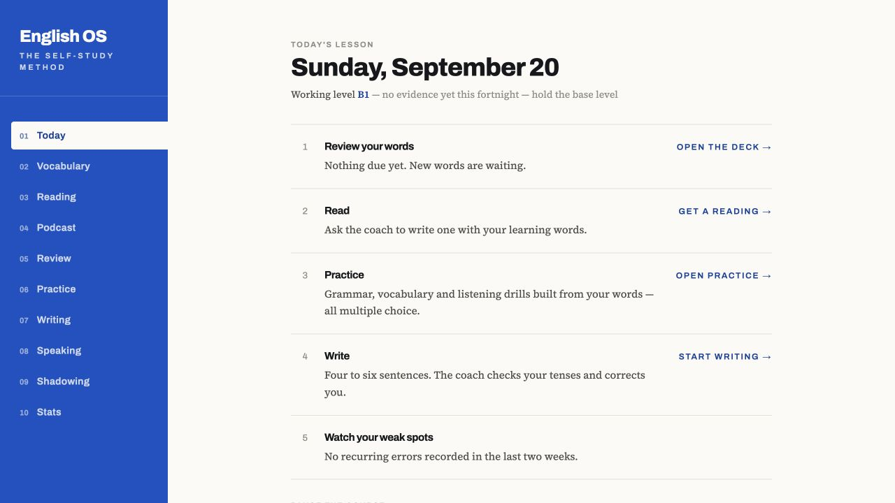
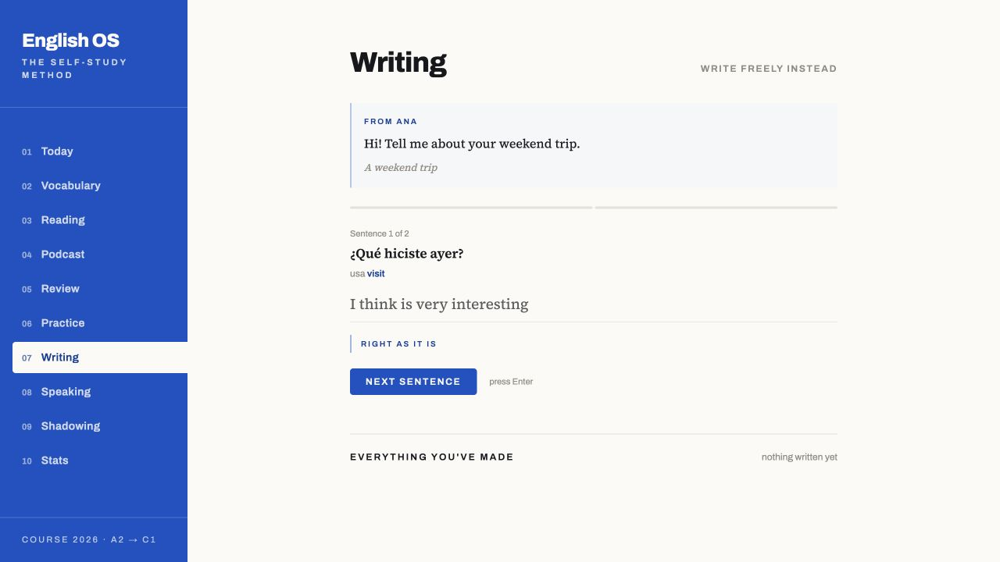
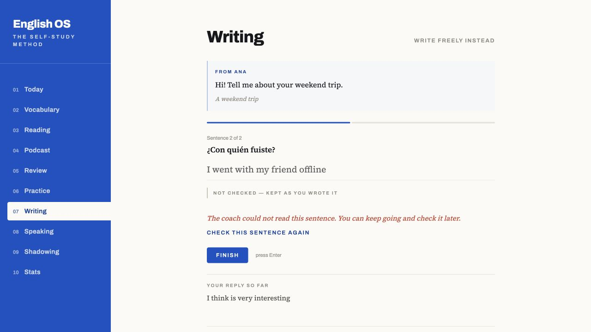
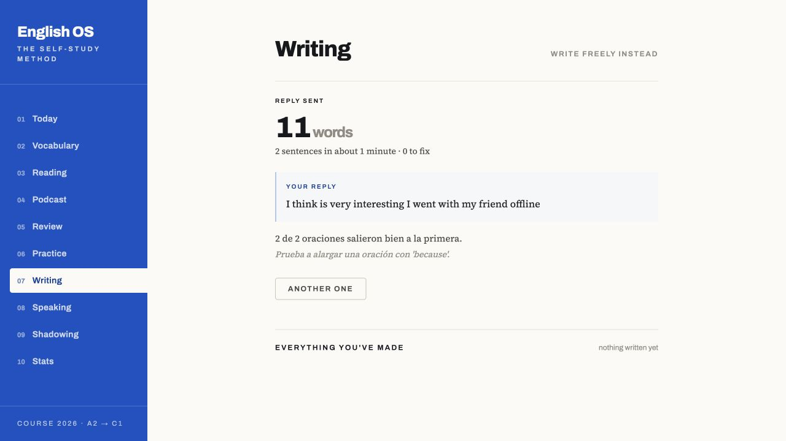
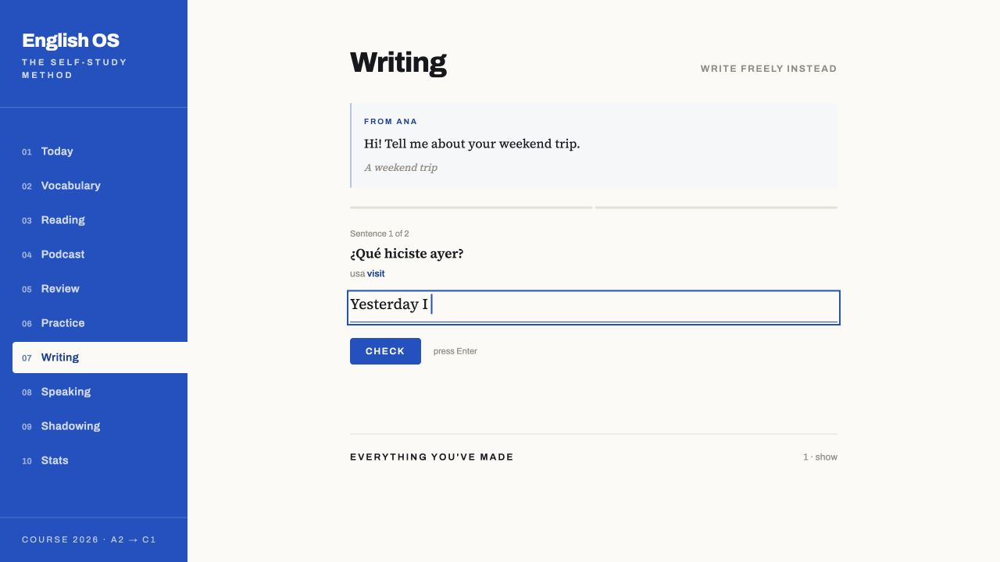
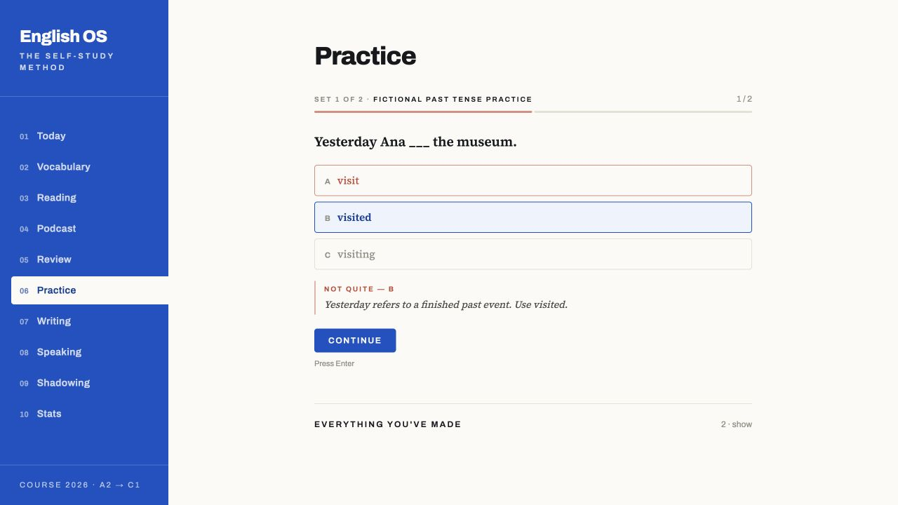
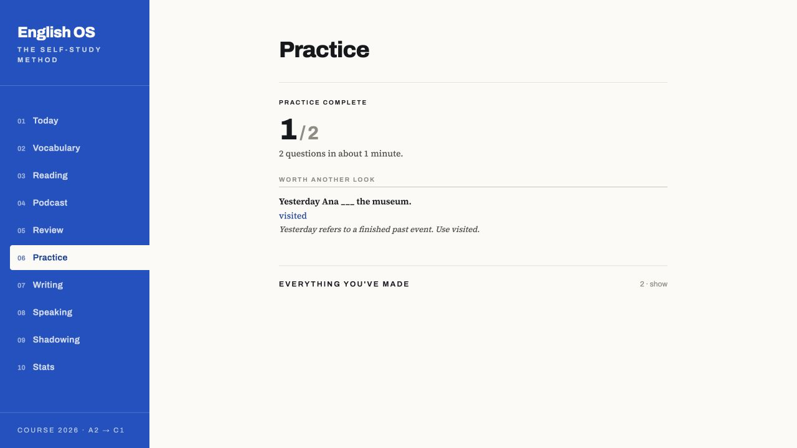
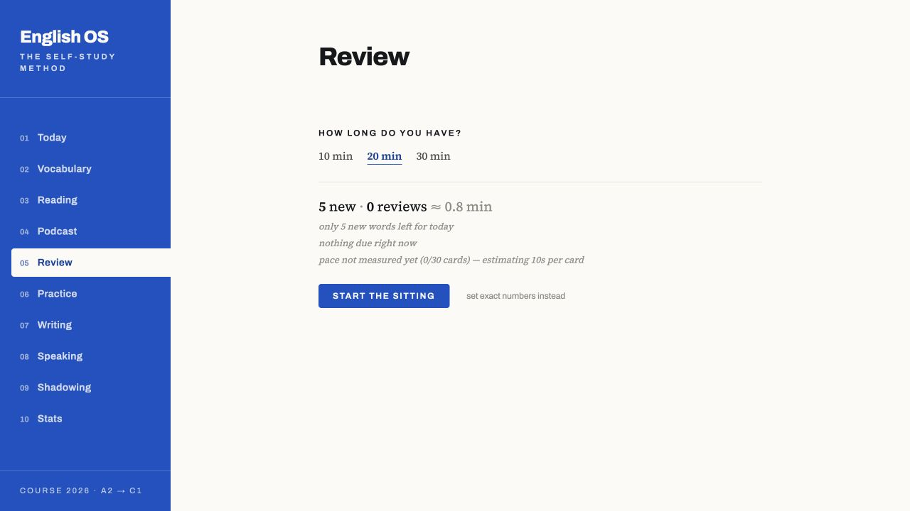
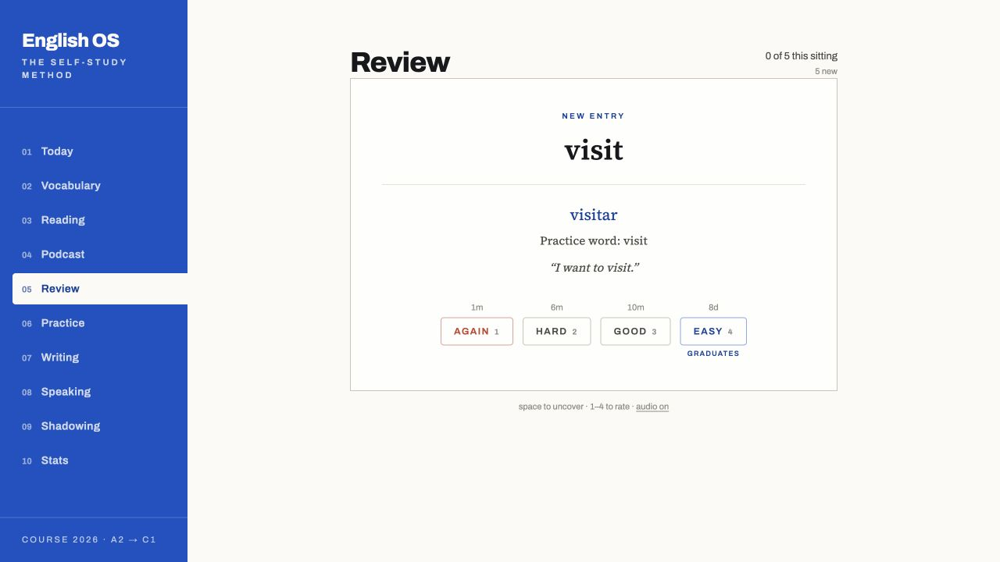

# English OS — prueba ficticia como estudiante

Fecha: 20 de septiembre de 2026. Perfil simulado: hispanohablante A2/B1, necesita ayuda para empezar a escribir, consulta vocabulario y comete errores de pasado. Evaluación realizada por un agente, no por un participante humano ni estudio longitudinal.

## Alcance y protección del progreso

Se copió el código actual, incluidos los cambios locales sin commit, a `/private/tmp/english-audit-20260920`. Se compiló allí el frontend. El servidor de prueba utilizó el puerto 8877, una base nueva `data/fiction.db`, seis palabras ficticias y dos actividades preparadas. Se sustituyó el proveedor de IA por respuestas deterministas y se desactivó el trabajador de generación. No se copió la base real ni se visitó el servidor de producción. No se ejecutaron morning, reset, sync-used ni escrituras a Notion/Anki. No se modificó el código de la plataforma; los únicos entregables añadidos al proyecto son este informe y sus capturas.

La simulación deliberadamente fuerza una traducción inválida y una caída del corrector: demuestra cómo responde la aplicación a esos fallos, no con qué frecuencia los produce la IA real. Los ejemplos y las dos preguntas son fixtures; no se juzga su calidad como material generado.

## Veredicto como estudiante

«Me resulta fácil empezar: veo una frase ya iniciada y una tarea pequeña. Practice me explica el error sin castigarme. Pero pierdo confianza cuando Writing felicita frases que no evaluó y pierdo mi texto al salir a consultar vocabulario. Al terminar una actividad necesito una indicación más clara de qué hacer después».

La prioridad es la fiabilidad del feedback y la continuidad del trabajo antes de añadir nuevos módulos.

## Recorrido y evidencia

1. **Today — funcional, orientación mejorable.** Lista ordenada con accesos claros. No ofrece un objetivo breve de aprendizaje ni un cierre del día. El texto de Writing todavía dice «Four to six sentences», mientras el modo guiado funciona una oración a la vez. El nivel B1 advierte que no hay evidencia; conservar esa transparencia.

2. **Writing: corrección descartada — fallo de alta prioridad.** Escribí `I think is very interesting`. El proveedor ficticio devolvió una traducción española inválida. La protección en `app/writing.py::check` la descarta, pero retorna `ok: true`. La interfaz muestra **RIGHT AS IT IS**. Como estudiante, aprendo que una frase incorrecta es correcta. Debe quedar «no evaluada», con reintento.

3. **Writing: corrector sin conexión — recuperación parcial.** La segunda respuesta provocó un fallo simulado. La interfaz informa **NOT CHECKED — KEPT AS YOU WROTE IT**, conserva la oración y permite reintentar o continuar. Esa respuesta visual está bien.

4. **Writing: cierre — fallo de alta prioridad.** Pulsé Finish. El resumen pasó a «0 to fix» y «2 de 2 oraciones salieron bien a la primera», aunque ninguna tenía una evaluación válida. Verificación en SQLite ficticio: `corrected=1`, `words_produced=11`, `errors_count=0`. `GuidedWriting.tsx::forServer` elimina `checked`; `writing.finish` convierte esa ausencia en una corrección completada. `model.errors` consume textos con `corrected=1`, por lo que esas palabras pueden diluir la tasa de errores cuando se alcance la muestra mínima; esta prueba de 11 palabras NO demuestra un cambio de nivel. Además, el historial seguía indicando «nothing written yet»; la entrada apareció al salir y volver.

5. **Writing → Vocabulary → Writing — pérdida de borrador confirmada.** Escribí `Yesterday I visited my sister and we cooked dinner.`, abrí Vocabulary y regresé. El campo volvió a `Yesterday I `, sin restauración ni aviso de pérdida. Hay que guardar texto, paso y respuestas pendientes, sin convertir un borrador en progreso completado.

6. **Practice: error — buen comportamiento en el caso probado.** Elegí `visit` para un pasado. Se mostró la alternativa correcta, un mensaje textual y una explicación; no depende exclusivamente del color. La secuencia de una pregunta a la vez reduce decisiones.

7. **Practice: cierre — correcto, siguiente paso mejorable.** Respondí bien la segunda pregunta. La pantalla y SQLite coinciden: 1/2. El resumen recupera el error, pero no ofrece una acción directa para practicarlo en una frase propia o pasar a la siguiente actividad. Propuesta pedagógica a validar: una microtarea opcional de transferencia, sin hacer obligatorio un texto largo.

8. **Review: planificación — buena transparencia, estimación a aclarar.** Elegí la opción disponible de 20 minutos: mostró cinco nuevas y 0 repasos ≈0.8 min, con aviso de escasez y ritmo no medido. Es útil que no invente trabajo. Conviene aclarar si la estimación cuenta sólo la primera pasada o también reapariciones de aprendizaje; no se midió una sentada completa.

9. **Review: respuesta — funcional en un repaso.** La tarjeta oculta inicialmente la respuesta y muestra intervalos antes de cada calificación. Pulsé Good y se registró exactamente un repaso en la base ficticia. Los nombres accesibles incluyen la próxima fecha relativa. La muestra no valida el algoritmo FSRS completo ni su eficacia a largo plazo.

## Prioridades y aceptación

| Prioridad | Cambio | Criterio observable |
|---|---|---|
| P1 | Estado explícito de evaluación de cada oración, de extremo a extremo | Traducción descartada y fallo de IA producen pending/invalid, nunca acierto; el cierre conserva pendientes y no afirma cero errores ni exactitud completa |
| P1 | Separar producción registrada de producción evaluada | Se conservan las palabras escritas, pero sólo muestras válidamente evaluadas entran al denominador de precisión; reintentar no duplica texto ni errores |
| P1 | Borradores recuperables | Navegar, recargar y volver conserva texto, paso y respuestas; borrador no altera racha, nivel ni FSRS |
| P2 | Actualizar historial al guardar | La sesión aparece inmediatamente, una sola vez, sin salir de Writing |
| P2 | Orientar inicio y cierre | Today explica la siguiente tarea con copy coherente; Practice ofrece una acción siguiente, con opción de terminar |
| P2 | Consolidación activa breve | Tras error, ofrecer opcionalmente una frase nueva; distinguir práctica asistida de producción independiente en la evidencia |
| P3 | Accesibilidad y lenguaje | Revisar contraste de texto tenue y tamaño de acciones; comprobar teclado, foco y anuncios de feedback con lector de pantalla antes de declarar conformidad |

## Fortalezas a conservar

Aspecto de cuaderno de estudio, tareas pequeñas, frase iniciada en Writing, explicación inmediata de Practice, intervalos explícitos y falta de datos declarada honestamente. No hace falta rediseñar toda la plataforma para corregir los fallos encontrados.

## Hallazgo adicional de código, no reproducido en navegador

`frontend/src/ComprehensionQuiz.tsx` descarta silenciosamente los errores de `submitQuiz` con `.catch(() => undefined)` y bloquea las respuestas ya elegidas. Añadir estado de guardado, error y reintento idempotente. Verificar con fallo de red en una prueba aislada antes de considerarlo reproducido.

## Límites

No se evaluaron Reading completo, Podcast, Speaking, Shadowing, calidad/latencia del modelo real, micrófono, pronunciación, reproducción de audio, móvil, lector de pantalla ni progresión real a C1. Los textos pequeños y tenues son un riesgo visual, no un incumplimiento WCAG medido. No se asigna una nota numérica global con esta muestra parcial.
