# English OS — análisis de UI/UX

> `/impeccable critique` sobre `frontend/src/` (las 10 lecciones), 2026-09-15.
> Method: dual-agent (A: revisión de diseño por flujos · B: detector + evidencia medible), sintetizado aquí.
> Sandbox: copia de `data/english.db` en `/tmp`, server en :8771, IA forzada a fallar. No se tocó la base real
> ni el caché de TTS. Capturas en [`docs/ui-ux-review/`](ui-ux-review/).
> `PRODUCT.md` se actualizó antes del análisis (Paso 0, con OK de Eddie). `DESIGN.md` no se tocó.

---

## 1. Veredicto

1. **El mundo no es el problema: la ejecución y las costuras sí.** Review, Stats y el player de Podcast se ven autorales y profesionales. Lo "amateur" aparece en las uniones entre módulos.
2. **No hay sistema compartido: cada módulo reinventó sus piezas.** Hay 65 class-strings de botón (6 primarios distintos), 4 anchos de columna, 17 tamaños de letra, 21 combinaciones de etiqueta en mayúsculas y 2 módulos (Speaking/Conversación y Shadowing) con la interfaz en español y otra familia de botones.
3. **La app no dice qué está pasando.**
   - Cerrar la sentada encola el material del día, pero ninguna pantalla lo muestra: el backend lo devuelve y el frontend lo descarta.
   - Las esperas del LLM no sobreviven a la navegación.
   - Hay 0 `aria-live` en todo el código.
   - Todo error de IA termina en "Check the AI setup", sin botón de reintento.
4. **Today no conduce la mañana.** Muestra seis filas con el mismo peso y cuatro CTA idénticos, no marca nada como hecho y el orden del rail (01–10) no coincide con el orden real del día (se empieza por la 05).
5. **Hay deuda medible real:**
   - el texto `ghost` da 3.22:1 en 82 textos que hay que leer;
   - el anillo de foco del rail es invisible (1.00:1);
   - no existe `prefers-reduced-motion`;
   - el Writing guiado dice "Right as it is" cuando la IA falla.

**Heurísticas de Nielsen: 21/40, aceptable.** Consistencia (1) y recuperación de errores (1) son las más bajas.

---

## 2. Top 10 problemas, ordenados por impacto en el hábito diario

Esfuerzo: S = horas · M = 1–2 días · L = varios días.

### 1. El material del día es invisible y el cierre de la sentada no lleva a ningún lado · P0 · M

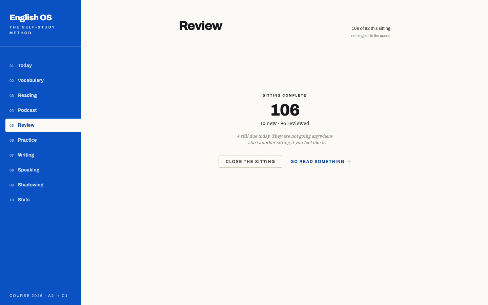

- **Pantallas:** 05 Review (cierre y Cooling), 01 Today, 06 Practice, 07 Writing, 03 Reading.
- **Evidencia:**
  - `app/session.py:258-266` devuelve `material` (el resultado de `jobs.enqueue_daily`). `api.ts:779-783` no lo declara en el tipo de `sessionEnd`. `ReviewPage.tsx:551` solo guarda `backlog`.
  - En el sandbox los jobs 111–114 (activities, tip, writing_task, reading) fallaron y ninguna pantalla lo dijo.
  - `ReviewPage.tsx:118` muestra "106 of 82 this sitting". `:130` dice "nothing left in the queue" mientras `:587-591` dice "4 still due today".
  - "Close the sitting" regresa a la pantalla de plan, no a Today. "Go read something" lleva al estante, no a la lectura del día.
  - Cooling ("Taking a breath", `ReviewPage.tsx:515-532`) no ofrece salida.
- **Rompe:** H1 (visibilidad del estado), H9 (recuperación de errores), la regla peak-end y PRODUCT.md ("waiting states are central").
- **Propuesta:**
  - En la tarjeta de cierre, una línea en book voice: *"Your reading, practice and message are being written — usually a few minutes. You can close this."* Si hay un fallo: *"The reading could not be written"* + **Try again**.
  - Contar "seen / planned" aparte de "answers", para que nunca salga "106 of 82".
  - **Close** → `/` (Today). **Read** → la lectura concreta del día.
  - En Cooling: *"Read while you wait →"*.
- **Ver también:** Today, en el problema 2.

### 2. Today no conduce la sesión · P1 · M

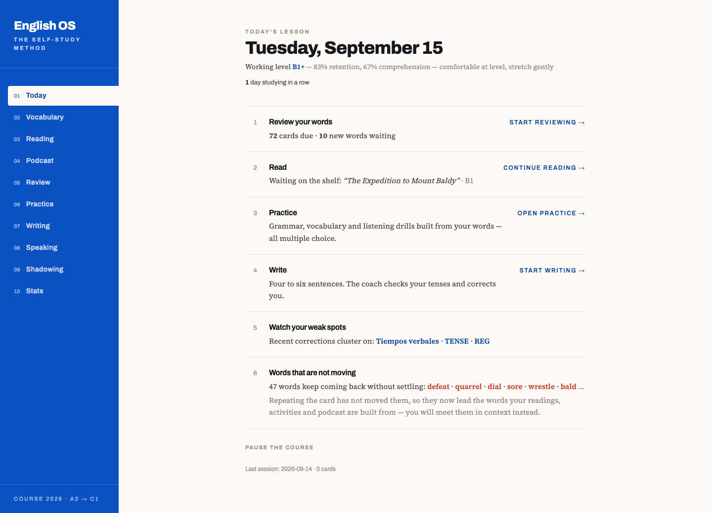
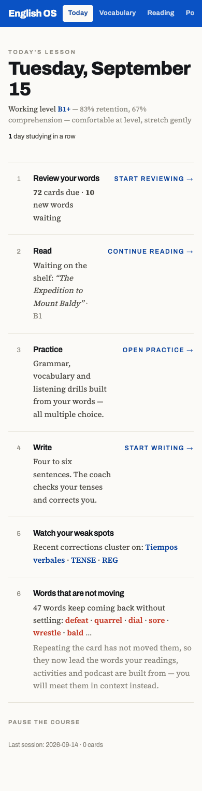

- **Pantallas:** 01 Today (y el regreso a Today tras la sentada, en `A-today-after-sitting-1440.png`: prácticamente idéntico).
- **Evidencia:**
  - Filas en `TodayPage.tsx:127-233` y el `Row` en `:290-319`: cuatro CTA con la misma clase, ninguno marcado como "siguiente", ningún estado de hecho.
  - `:190-191` sigue en "Four to six sentences", aunque el modo guiado es el default desde M20.
  - "Last session: 2026-09-14 · 0 cards" (`:276-282`) pinta un 0 cuando `cards_reviewed` viene `null`, lo que choca con Evidence over sensation.
  - Podcast, Speaking y Shadowing no aparecen en el plan del día.
  - A 390 px el CTA comprime la descripción a unos 140 px.
- **Rompe:** H8 (jerarquía), tiempo hasta la primera acción, DESIGN regla 10 (el orden numerado ya no es el orden del día) y PRODUCT (una sola escritura corta).
- **Propuesta:** Today como conductor.
  - La primera fila no completada lleva **el único botón cobalto sólido**; las demás, link.
  - Cada fila con estado leído de `/api/today` + `/api/jobs`:
    - `ready` → CTA;
    - `queued` → "the coach is writing…" en ghost itálica;
    - `done` → ✓ con cifra exacta ("106 reviewed");
    - `failed` → motivo + Retry.
  - Estimado total del día arriba ("about 35 min today").
  - Copy de Write: "One short message, a sentence at a time."
  - A <lg el CTA pasa debajo del texto.
  - Para el "0 cards" con dato nulo: "not recorded".

### 3. Las esperas del LLM no se entienden, no se anuncian y no sobreviven a la navegación · P1 · M

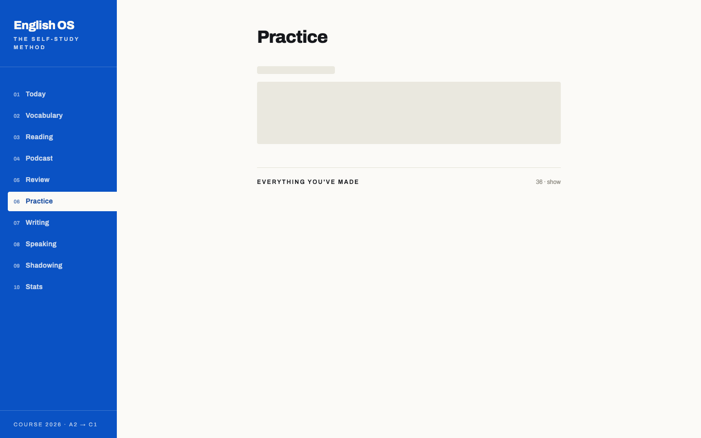

- **Pantallas:** 06 Practice, 07 Writing (guiado y libre), 08 Speaking (monólogo y conversación), 03 Reader (¶), 03 Reading y 04 Podcast (generar), 09 Shadowing.
- **Evidencia:**
  - **Practice y Writing:** llaman endpoints síncronos que pueden tardar de 15 a 80 s y solo muestran un bloque gris pulsante sin texto (`PracticePage.tsx:44-49`, `GuidedWriting.tsx:89-95`, `SpeakingPage.tsx:157-158`).
  - **Reading y Podcast:** tienen buen copy de cola ("In line behind other work — N ahead. One at a time keeps the laptop cool."), pero el estado vive en el componente (`ReadingPage.tsx:81-110`, `PodcastPage.tsx:31-51`). Al volver no se recupera: no hay `api.jobs()` al montar.
  - **Shadowing:** promete "Puedes irte a otra pantalla: sigue en marcha" (`ShadowingPage.tsx:179-182`), pero al volver no hay indicador.
  - **Ninguna espera** muestra el tiempo transcurrido.
  - **`aria-live` / `role=status|alert` / `aria-busy`: 0** en código y en runtime.
- **Rompe:** H1, H3 (el control se pierde al navegar), la sección "Waiting" de DESIGN y PRODUCT ("be able to do something else meanwhile").
- **Propuesta:** un componente `<Waiting kind>` compartido.
  - Al montar busca un job pendiente de ese `kind` y se reengancha.
  - Muestra copy en book voice + tiempo transcurrido ("0:42 — usually under a minute").
  - Va dentro de `role="status" aria-live="polite"`.
  - Practice y el prompt de Writing/Speaking pasan a job encolado (el material del día ya se genera en cola; la pantalla solo tiene que leerlo).

### 4. Errores de IA sin acción, y el Writing guiado miente y pierde trabajo · P1 · S

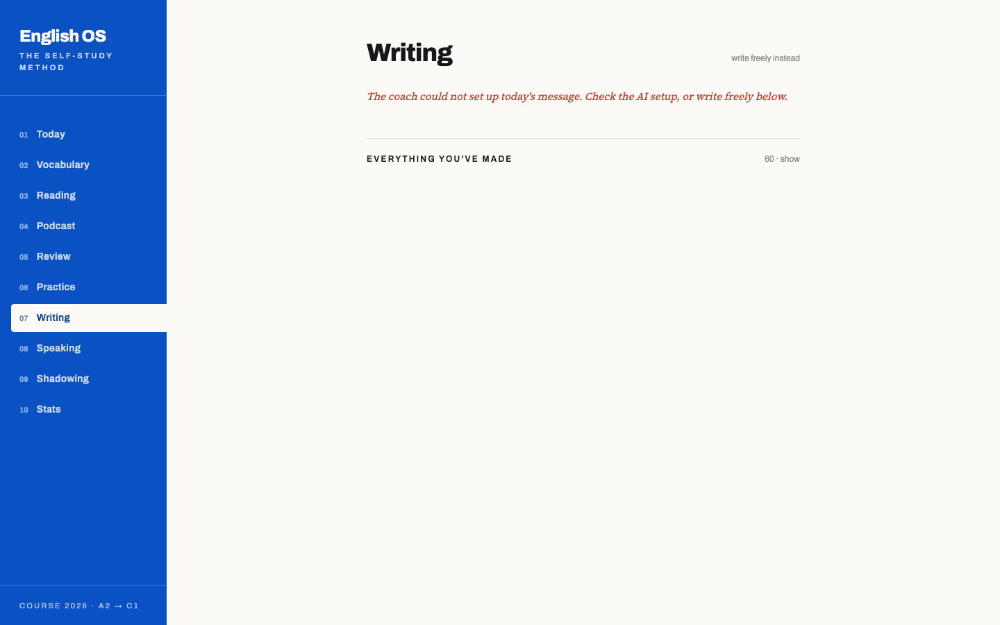
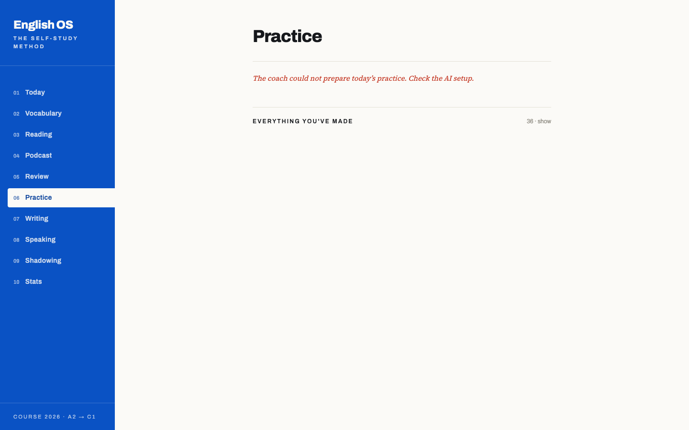

- **Pantallas:** 07 Writing, 06 Practice, 08 Speaking, 03 Reader, 03 Reading, 04 Podcast.
- **Evidencia:**
  - `GuidedWriting.tsx:57-59`: el `catch` pone `ok: true`. Si la IA falla al revisar una oración, la UI dice "Right as it is", es decir, afirma algo que nadie verificó.
  - `GuidedWriting.tsx:74-78`: si falla `writingFinish`, `setFailed(true)` muestra "The coach could not **set up** today's message… or write freely **below**". Es el mensaje equivocado, se pierden las oraciones escritas y debajo solo está el archivo. El único escape ofrecido es escritura libre larga, justo lo que Eddie abandona.
  - Errores idénticos sin botón: `PracticePage.tsx:25-27`, `WritingPage.tsx:146`, `SpeakingPage.tsx:140`, `ConversationPanel.tsx:68` ("check the AI setup **in Reading**", un puente de memoria a otra pantalla), `ReaderPage.tsx:403`, `PodcastPage.tsx:46`, `ReadingPage.tsx:105`.
- **Rompe:** H9 (recuperación de errores), H5 (prevención de errores), H6 (reconocer en vez de recordar) y el principio 4 de PRODUCT.
- **Propuesta:** un `<ErrorLine>` compartido: causa concreta desde `job.error` ("Ollama isn't running" / "the model isn't downloaded"), **Try again** y un link directo al panel de setup.
  - **En el guiado:**
    - estado neutral "Not checked — kept as you wrote it" en lugar de "Right";
    - conservar las oraciones y ofrecer Retry en `finish`;
    - quitar "below".

### 5. Speaking (Conversación) y Shadowing están fuera del sistema: idioma, botones y columna · P1 · M

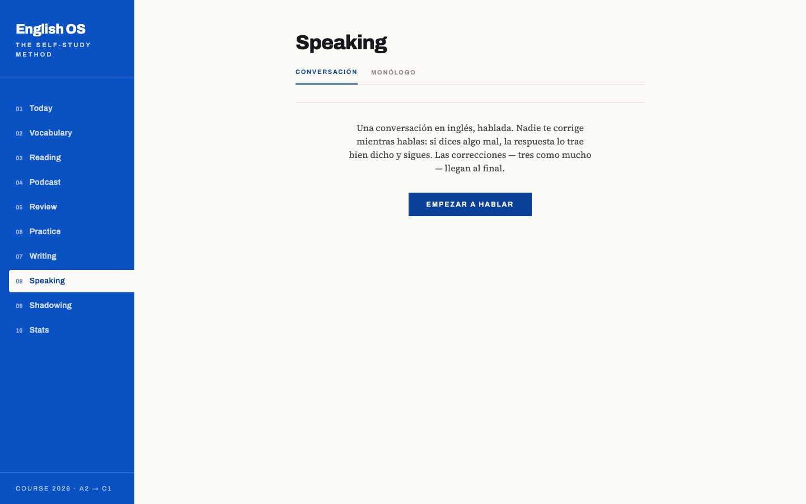
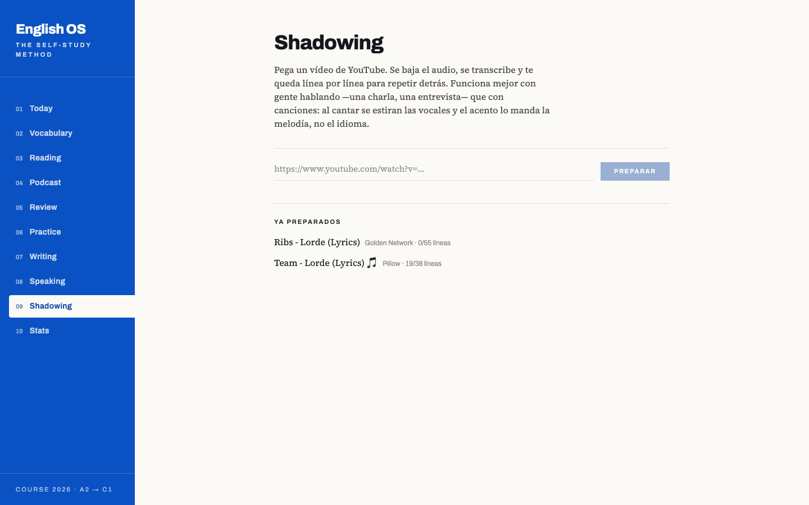

- **Pantallas:** 08 Speaking, 09 Shadowing.
- **Evidencia:**
  - **Interfaz en español:**
    - tabs "Conversación/Monólogo" (`SpeakingPage.tsx:114`);
    - "Empezar a hablar", "Tú", esperas y errores (`ConversationPanel.tsx:139-151,175,195-226`);
    - "Preparar", "Ya preparados", "Línea N de M", "← Anterior" y el párrafo intro (`ShadowingPage.tsx:149-296`).
    - `lang="es"` en esos textos: 0.
  - **Otra familia de botón:** `bg-cobalt-deep text-white`, sin `rounded-sm`, `px-8 py-3 tracking-[0.18em]` (`ConversationPanel.tsx:146,200,298`; `ShadowingPage.tsx:168,259`).
  - **Otra columna:** `max-w-3xl px-8 py-14` sin responsive (`ShadowingPage.tsx:149,225`). El borde del contenido salta de x=528 a x=488 al cambiar de lección.
  - **Doble regla** bajo las tabs de Speaking (`SpeakingPage.tsx:103-124` + `ConversationPanel.tsx:137`).
  - **Correcciones con tachado** (`ConversationPanel.tsx:272`) en lugar de la gramática ✗/✓ del resto (`WritingPage.tsx:248-250`).
  - **Emoji 🎵** en la lista de Shadowing.
  - **PREPARAR deshabilitado** a 2.16:1.
- **Rompe:** DESIGN reglas 9 (UI chrome en inglés), 5 (español solo on demand), 6 y la gramática ✗/✓. H4 (consistencia). Es la fuente más visible de "hecho por módulos".
- **Propuesta:**
  - Interfaz en inglés. La explicación de "nadie te corrige mientras hablas" queda tras el chip **Uncover Spanish**.
  - Botón, contenedor de página y gramática ✗/✓ compartidos.
  - El emoji pasa a glyph SVG o sale.

### 6. No hay sistema de componentes ni escala: el origen de la sensación "amateur" · P1 · L

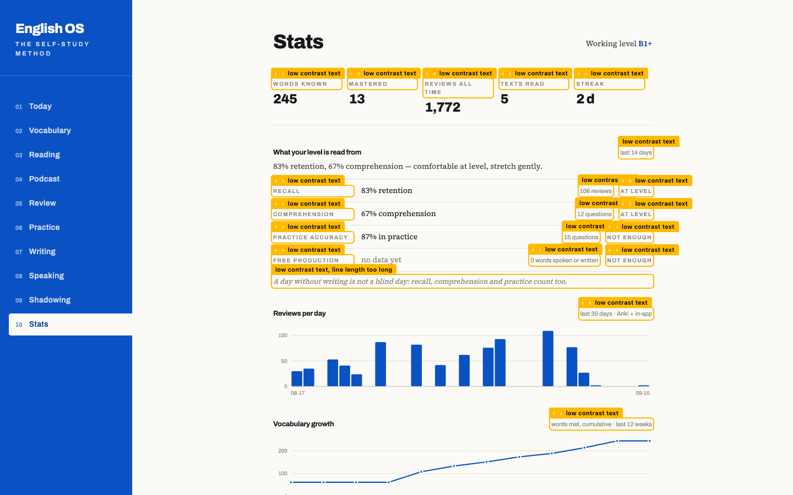

- **Pantallas:** las 10.
- **Evidencia (medida):**

  **Botones:** 65 class-strings en 84 `button/Link/a`. Los primarios sólidos son 6 variantes visuales:

  | Variante | Clases | Dónde |
  |---|---|---|
  | A | `bg-cobalt px-5 py-2 12px 0.14em` | la mayoría |
  | B | `px-4 py-1.5 11px` | `PodcastPage:269`, `ReaderPage:357`, `ReadingPlayer:98`, `TodayPage:257` |
  | C | `px-6 py-2.5 0.16em` | `ReviewPage:209,441`, `SpeakingPage:165` |
  | D, E, F | `bg-cobalt-deep text-white` sin radio | Conversación y Shadowing |

  Además hay 7 variantes de botón de texto en mayúsculas y 8 de botón bordeado.

  **Cabeceras y columnas:** 4 anchos de columna, con el borde izquierdo en x = 440, 457–496, 488 y 528 px a 1440. La anatomía de cabecera varía por lección:

  | Lección | Cabecera |
  |---|---|
  | Today | overline + H2 + subtítulo |
  | Reader | H2 en serif 3xl |
  | Vocabulary, Reading, Podcast, Review | H2 + conteo a la derecha |
  | Practice, Speaking | H2 solo |
  | Shadowing | H2 + párrafo |

  **Tipografía:**
  - 376 declaraciones con 17 tamaños distintos: `text-[10px]` ×52, `[11px]` ×53, `[12px]` ×81, `[13px]` ×37, `[14px]` ×43, `[15px]` ×36, más 9/16/17/19 px.
  - 7 valores de tracking entre 0.12 y 0.28 em.
  - 21 combinaciones distintas de etiqueta en mayúsculas (130 usos).
  - `WordEntry.tsx:89` usa `font-sans`, que no existe en `@theme` y cae al stack del sistema en vez de Archivo.

  **Skeletons y estados:**
  - 9 skeletons de bloque gris con `animate-pulse` (`TodayPage:119`, `PracticePage:45`, `StatsPage:40`…), cuando la regla 7 pide líneas rayadas.
  - 3 fórmulas distintas de "no se pudo abrir" (`TodayPage:48` vs `VocabularyPage:47` vs `ReaderPage:162`).

  **Motion:**
  - `SLIDE` es único y está bien usado: 26 de 26 `motion.*`.
  - Vive en `VocabularyPage.tsx:10` y lo importan 11 archivos, con amplitudes de 6 a 24 px.
  - Hay 62 `transition-colors` de Tailwind, 11 `animate-pulse` y 2 `duration-300`.
- **Rompe:** H4 (consistencia, nota 1), DESIGN reglas 4, 6 y 7.
- **Propuesta:** `extract` de primitivas y tokens:
  - `PageHeader` (overline opcional · H2 · meta a la derecha);
  - `Page` (un solo contenedor: `max-w-2xl` para estudio, `max-w-3xl` para evidencia);
  - `Button` (primary / secondary / text);
  - `Choice`, `ErrorLine`, `Waiting`, `RuledSkeleton`, `Section`;
  - `motion.ts` con `SLIDE` y 2 amplitudes.
  - Escala tipográfica de 10 pasos en `@theme`:

    | Paso | Tamaño / interlineado | Uso |
    |---|---|---|
    | `label` | 11/1.2, 0.16em | etiquetas en mayúsculas |
    | `meta` | 12/1.45 | datos secundarios |
    | `action` | 12, 0.14em | botones |
    | `ui` | 14 | interfaz |
    | `note` | 14 serif italic | notas |
    | `body` | 16/1.65 | texto corrido |
    | `read` | 17/1.75 | lectura |
    | `lede` | 20 | entradilla |
    | `title` | 28 serif | títulos de lectura |
    | `h2` | 36 | cabecera de lección |
    | `display` | 48 | cifras grandes |

    Con eso el tracking queda en 3 valores. Todo `text-[Npx]` se mapea a un paso; tabla completa en la sección 6.

### 7. Contraste y foco: el texto que hay que leer queda por debajo de AA · P1 · S

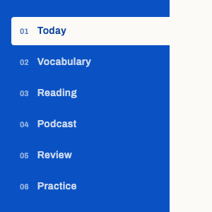

*Arriba: "04 Podcast" tiene el foco de teclado y no se ve nada.*

- **Pantallas:** las 10; la peor es 10 Stats (34 hallazgos de low-contrast del detector y 30 textos de 9 px en ejes).
- **Evidencia (medida):**
  - **`ghost` `#8F8C83`:** 3.22:1 sobre paper, 3.02 sobre cobalt-wash y **1.79** al 55 % (entradas NEW).
    - Los 145 `text-ghost` se clasifican así: **82 hay que leerlos** (IPA, intervalos encima de los botones de rating, atajos de teclado, veredictos de Stats, placeholders, controles no seleccionados, esperas), 58 son metadato y 5 son decorativos.
    - Lista completa con `archivo:línea` en la sección 6.
  - **Anillo de foco:** `*:focus-visible` pinta `2px cobalt` también sobre el rail cobalto, lo que da **1.00:1**, invisible en las 10 lecciones.
  - **Rail:** número inactivo 3.15:1; footer 4.08:1 a 11 px.
  - **Tamaños mínimos:** 9 px en ejes SVG (`StatsPage.tsx:304,337,338,385,414,415`), 10 px en dt/veredictos y 9–10 px en "graduates" (`ReviewPage.tsx:666`).
  - **Detector en navegador:** 76 hallazgos en 5 páginas (low-contrast 42, undersized/tiny 24, line-length 5, text-occlusion 4 falsos positivos, kicker 1). El detector estático sale limpio (exit 0).
- **Rompe:** WCAG 1.4.3 y 2.4.7; DESIGN regla 8 ("focus ring 2px cobalt": nunca contempló el rail).
- **Propuesta:**
  - Separar el token en `ghost-ink` `#76746C` (4.5:1, para texto que se lee) y `ghost-mark` `#8F8C83` (reglas, índices, decoración).
  - Las entradas NEW bajan la opacidad del margen, no del texto.
  - Anillo de foco en `paper` dentro del `aside`.
  - Mínimo 11 px para texto y 10 px solo para ejes, en ghost-ink.

### 8. Reader: todo está subrayado, la palabra desconocida no tiene significado y ¶ solo existe en hover · P1 · M

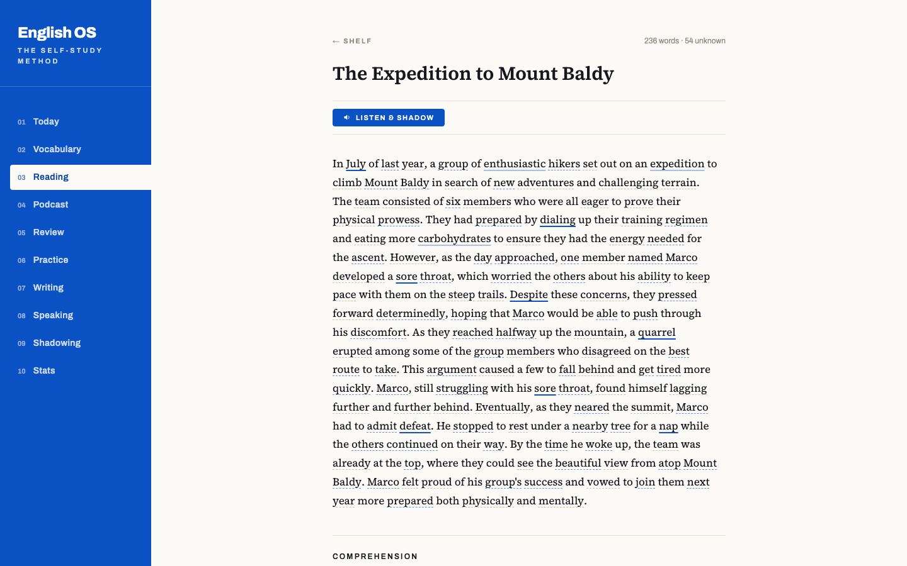
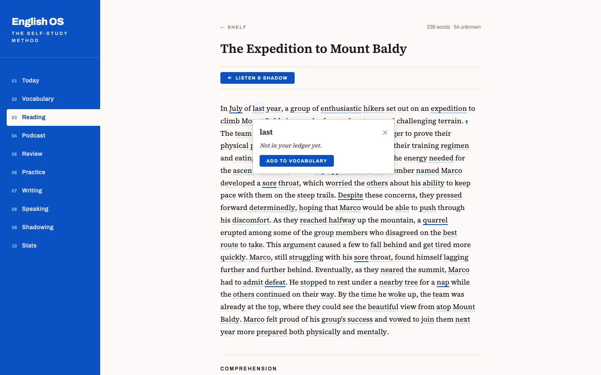
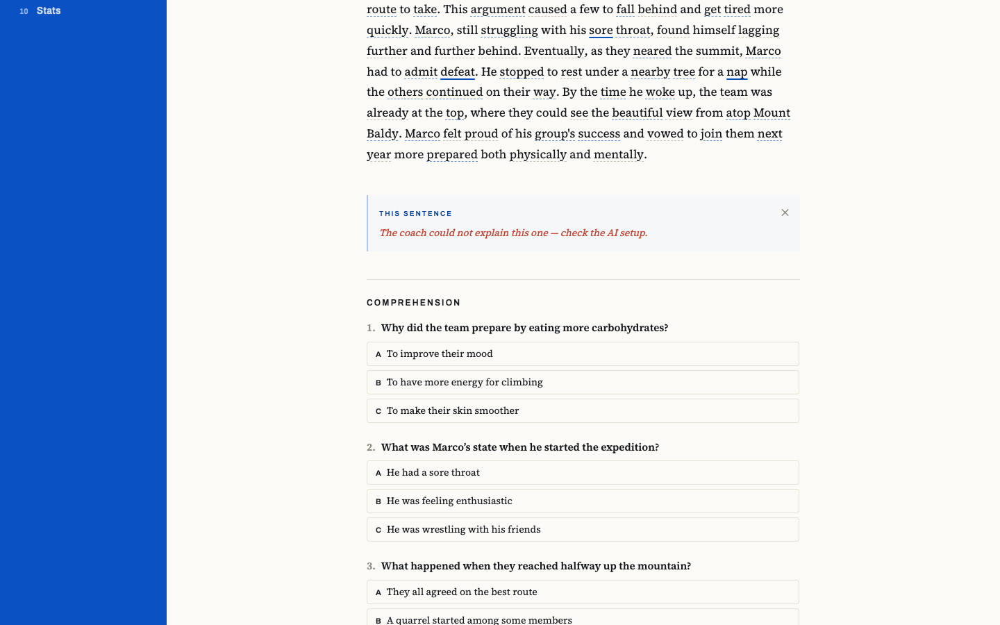

- **Pantallas:** 03 Reader.
- **Evidencia:**
  - **Subrayados:** con 2,859 palabras NEW, casi cada palabra lleva tinta. En la lectura del día, "236 words · 54 unknown" incluye *last, year, take, top, time, way* (`ReaderPage.tsx:18-24,82-88`).
  - **Palabra desconocida:** el slip solo ofrece "Not in your ledger yet" + "Add to vocabulary", sin significado (`:352-363`).
  - **¶:** está en `hidden group-hover:inline` (`:262-271`), así que no se alcanza con teclado ni con touch.
  - **Explicación:** el aside se renderiza después del artículo (la oración en y≈337, la explicación en y≈874, `:371-417`) y falla sin reintento (`:401-404`).
  - **Tab:** recorre 248 palabras antes de llegar al quiz.
- **Rompe:** H8 (el ruido tapa la señal), H6, H7; el principio 5 ("lo que no enseña, sobra"); DESIGN M10 ("never a modal over the text" implica contexto).
- **Propuesta:**
  - Por defecto, tinta solo en LEARNING y en *words that are not moving*; NEW y desconocidas planas, con un toggle "Show all marks" en la meta del header.
  - Significado on demand para desconocidas (deck local o job de IA) antes de "Add".
  - ¶ visible en `:focus-within` y siempre a <lg; el aside se inserta tras el párrafo de la oración.
  - `roving tabindex` en las palabras (una parada de Tab por párrafo, flechas dentro).

### 9. El rail ya no es un mapa del día: 10 lecciones planas, y a 390 px la activa queda fuera de vista · P2 · S–M

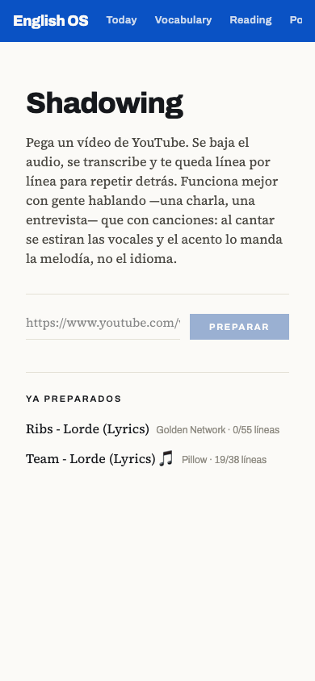

- **Pantallas:** todas (rail).
- **Evidencia:**
  - **A 1440:** las 10 caben (y 174–610), con igual peso y numeradas 01–10 en orden de roadmap. El día real es 05 → 03 → 06 → 07.
  - **A 390:** 253 px visibles de 736 px de `scrollWidth`. Solo se ven Today, Vocabulary y Reading. En `/review` y `/shadowing` el item activo queda fuera de pantalla, sin auto-scroll ni pista de que hay más.
  - **Documentación desfasada:** DESIGN regla 10 dice "01–06", DESIGN:170 y `App.tsx:53` dicen "Eight lessons".
- **Rompe:** DESIGN regla 10; H1 (ubicación); carga cognitiva (>4 opciones sin agrupar).
- **Propuesta:** agrupar sin ocultar, en tres bloques bajo etiquetas `label`:
  - **The day** (Today · Review · Read · Practice · Write);
  - **Studio** (Podcast · Speaking · Shadowing);
  - **Ledger** (Vocabulary · Stats).

  La numeración sigue el orden del día. A <lg: `scrollIntoView({inline:'center'})` del activo + fade en el borde. Reescribir la regla 10.

### 10. Accesibilidad estructural y robustez · P2 · S–M

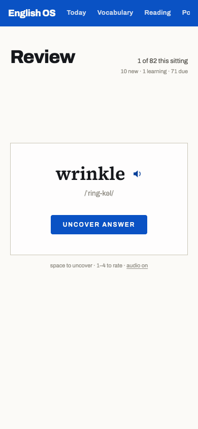

- **Pantallas:** 02 Vocabulary, 03 Reader, 03 Reading, 05 Review, 06 Practice, 07 Writing, todas.
- **Evidencia:**
  - **Botones:** 49 `button` anidados dentro de `button` en el ledger (el PlayButton `WordEntry.tsx:82` dentro de `:72`).
  - **Navegación por teclado:**
    - no hay skip link: el contenido empieza siempre en el Tab 11;
    - el slip del diccionario tiene `role="dialog"` sin Esc ni retorno de foco (`ReaderPage.tsx:283-293`);
    - "Delete" está en `opacity-0` hasta hover pero es tabulable, así que es invisible con foco (`ReadingPage.tsx:296-300`, `History.tsx:85-89`; 71 en el estante).
  - **Semántica:**
    - los botones de rating tienen `role="radiogroup"` sin ser radios (`ReviewPage.tsx:218`);
    - salto h2→h4 en History (`History.tsx:63`);
    - `document.title` es siempre "English OS" en las 11 rutas.
  - **Movimiento:** `prefers-reduced-motion` / `useReducedMotion`: 0 resultados.
  - **Español sin `lang="es"`:** el "why" de Practice (`PracticePage.tsx:275`), "usa" (`GuidedWriting.tsx:144`), además de lo del problema 5.
  - **Rutas:** el episodio de Podcast y la sesión de Shadowing no tienen URL, así que el botón atrás te saca.
  - **Targets:** los CTA de Today miden 18 px de alto; el audio del ledger, 14×14.
- **Rompe:** WCAG 4.1.2, 2.4.1, 2.4.2, 2.3.3; DESIGN regla 8; H3; H7.
- **Propuesta:**
  - PlayButton fuera del botón de fila.
  - Skip link "Skip to the page".
  - Esc y retorno de foco en el slip.
  - `group-focus-within:opacity-100` en Delete.
  - Quitar el radiogroup.
  - `h3` en History.
  - `document.title` por lección.
  - `<MotionConfig reducedMotion="user">` + `motion-reduce:animate-none`.
  - Rutas `/podcast/:id` y `/shadowing/:id`.
  - `min-h-6` en CTAs de texto.

---

## 3. Scorecard por lección

Notas de 0 a 4. Columnas: **Estado** = H1 visibilidad · **Consist.** = H4 · **Ctrl/Err** = H3 + H9 · **Efic.** = H7 · **Estét.** = H8 · **A11y** = medido por B (contraste, foco, `lang`, targets).

| Lección | Estado | Consist. | Ctrl/Err | Efic. | Estét. | A11y | Total /24 | Problema principal |
|---|---|---|---|---|---|---|---|---|
| 01 Today | 1 | 3 | 2 | 2 | 3 | 2 | **13** | No refleja la cola ni lo hecho; 4 CTA iguales; copy de Write obsoleto; "0 cards" inventado |
| 02 Vocabulary | 3 | 2 | 3 | 3 | 2 | 1 | **14** | Muro de 82 chips redondeados (regla 6) sobre el ledger; 49 botones anidados |
| 03 Reading · Reader | 2 | 3 | 1 | 2 | 2 | 1 | **11** | Todo subrayado; desconocida sin significado; ¶ solo hover, lejos y sin retry |
| 04 Podcast | 3 | 3 | 2 | 3 | 3 | 2 | **16** | Episodio sin ruta; la espera de grabación se pierde al navegar |
| 05 Review | 3 | 4 | 2 | 4 | 4 | 2 | **19** | "106 of 82"; cierre sin puente a Today ni al material; Cooling sin salida |
| 06 Practice | 1 | 3 | 1 | 3 | 3 | 2 | **13** | Espera síncrona sin copy; error sin retry; "why" sin `lang="es"` |
| 07 Writing | 2 | 2 | 0 | 3 | 3 | 2 | **12** | "Right as it is" cuando la IA falla; pierde las oraciones; "write freely below" falso |
| 08 Speaking | 2 | 0 | 2 | 2 | 2 | 1 | **9** | Interfaz en español, otro botón, doble regla, 0 `lang="es"` |
| 09 Shadowing | 2 | 0 | 2 | 3 | 2 | 1 | **10** | Todo en español; otra columna y otros botones; sin ruta; emoji |
| 10 Stats | 3 | 3 | 3 | 2 | 3 | 1 | **15** | 34 textos bajo AA, 9 px en ejes, notas a ~106 ch; "Anki + in-app" y "4.621" sin formato |

**Heurísticas globales (app completa)**

| # | Heurística | Nota | Problema clave |
|---|---|---|---|
| 1 | Visibilidad del estado | 2 | El material encolado es invisible; esperas sin tiempo ni `aria-live` |
| 2 | Lenguaje del usuario | 3 | Buena voz de libro; se cuela jerga ("Ease 1.50", "Tiempos verbales · TENSE · REG" mezclados) |
| 3 | Control y libertad | 2 | Esc no cierra el slip; Cooling sin salida; players sin URL; las esperas se pierden al navegar |
| 4 | Consistencia | 1 | Dos idiomas de interfaz, 6 botones primarios, 4 columnas, 2 gramáticas de corrección, 2 tipos de skeleton |
| 5 | Prevención de errores | 2 | "Right as it is" sin verificar; contador desbordado. A favor: "Sure?" y el plan previo de la sentada |
| 6 | Reconocer, no recordar | 2 | "check the AI setup in Reading"; ¶ solo en hover |
| 7 | Flexibilidad y eficiencia | 3 | Review y Practice con teclado completo; el Reader obliga a tabular 248 palabras |
| 8 | Estética y minimalismo | 3 | Muy limpio salvo los subrayados del Reader, los chips de Vocabulary y el Today plano |
| 9 | Recuperación de errores | 1 | Nunca hay Retry; mensajes equivocados en Writing |
| 10 | Ayuda y documentación | 2 | Buena ayuda inline (plan de Review, Stats); nada guía la configuración de la IA |
| | **Total** | **21/40** | **Aceptable** |

**Carga cognitiva:** fallan 4 de 8 (alta).
- **Single focus:** falla en el Reader.
- **Jerarquía:** falla en Today.
- **Memoria de trabajo:** falla en los errores ("en Reading").
- **Divulgación progresiva:** falla en Vocabulary ("Studied today" abierto con 82 chips).

Decisiones con más de 4 opciones: el rail (10), "Lesson written for you" (12 opciones visibles), el estudio de Podcast (9) y el player de Podcast (7 controles).

**Viaje emocional de la mañana**

| Momento | Qué pasa |
|---|---|
| **Pico** | El ritmo de teclado en Review con los intervalos visibles. |
| **Valles** | "Taking a breath" sin salida; Practice y Writing que abren en una línea roja. |
| **Final** | "106 of 82 · nothing left" junto a "4 still due", con la recompensa real (el material del día) invisible. Close te devuelve a una pantalla de plan. |

El final de la sesión, que es lo que más pesa en si vuelves mañana, es hoy el punto más débil.

---

## 4. Lo que ya está bien (no romperlo)

- **Review:**
  - la palabra en book voice y el reveal con `SLIDE`;
  - intervalos encima de cada rating con "graduates";
  - atajos space y 1–4;
  - la tarjeta "New entry";
  - el plan previo con estimado y nota de incertidumbre.
- **Practice:**
  - una pregunta por pantalla, con marca inmediata;
  - el "why" como aside;
  - segmentos de progreso;
  - A/B/C + Enter;
  - "Worth another look".

  Es el modelo de interacción que PRODUCT pide (opción múltiple).
- **Copy de espera de Reading y Podcast:** honesto y en voz propia ("One at a time keeps the laptop cool"). Es la base del `<Waiting>` compartido.
- **Stats:**
  - tabla de evidencia con muestra y veredicto en palabras;
  - "no data yet" respetado;
  - costo del retraso;
  - una serie cobalto por gráfica.
- **Player de Podcast:** una fila de control, modo como palabras subrayadas, speakers con color y nombre.
- **Patrones sin diálogo:** borrado con "Sure?" de 4 s, archivo colapsado (`History.tsx`) y pausa como palabra fantasma con "held page".
- **`SLIDE`:** una sola ley de movimiento, bien aplicada en los 26 elementos `motion.*`. Sin springs ni efectos sueltos.
- **Voz editorial:** "The deck is clear.", "They are not going anywhere", la fila "Words that are not moving".
- **Tokens y marco del navegador:** paleta, selección cobalto, caret, las dos voces tipográficas (Archivo / Source Serif) y las marcas de estado del ledger.
- **Detector:** el estático sale limpio. No hay anti-patterns de plantilla (degradados, glassmorphism, tarjetas con sombra, side-tabs gruesos).
- **Responsive:** 0 overflow horizontal a 390 px en las 11 rutas.

Referencias visuales de lo que funciona:

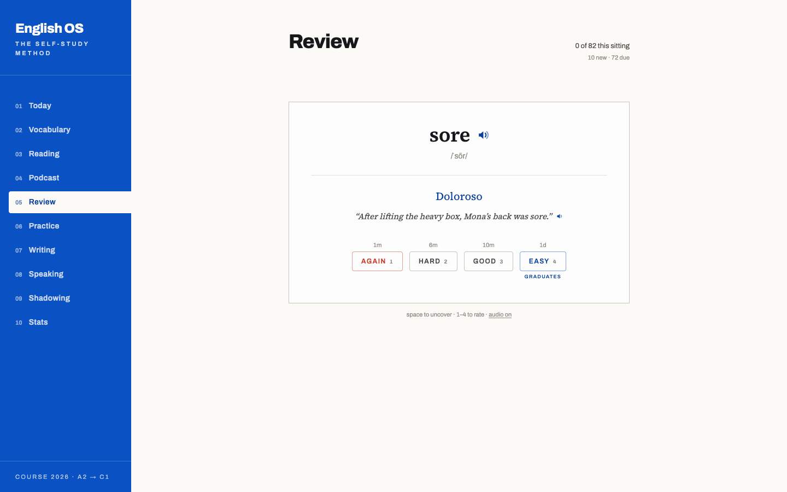
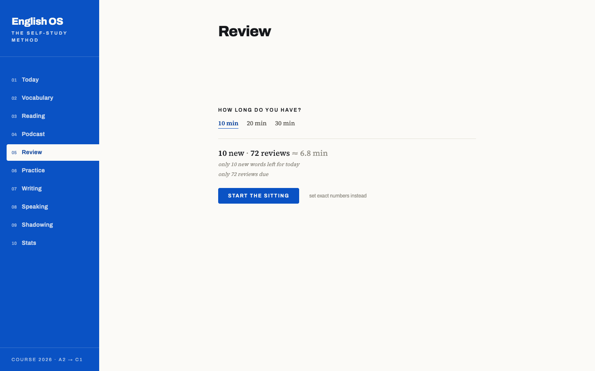
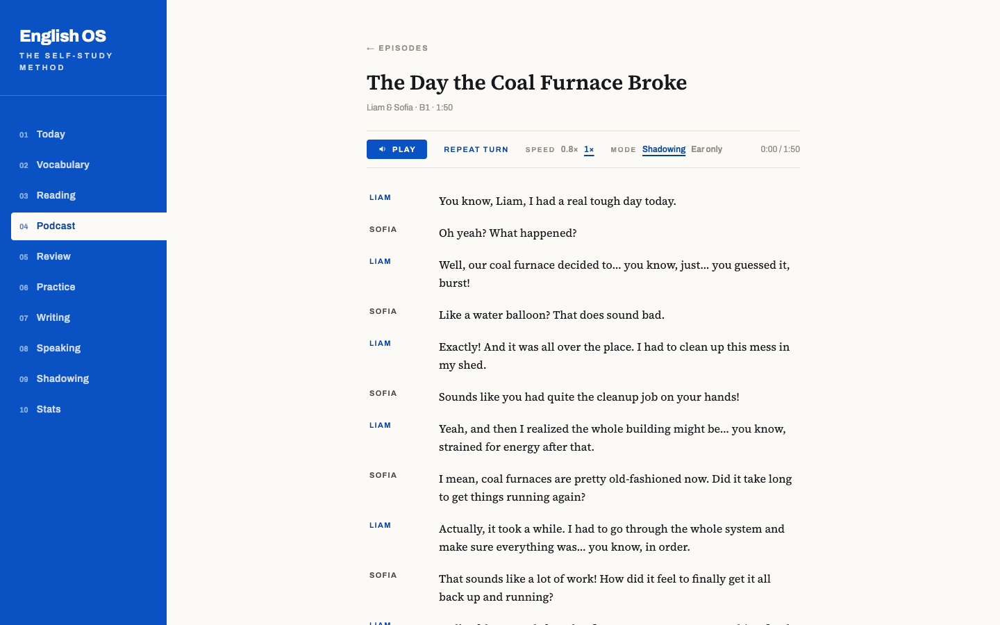
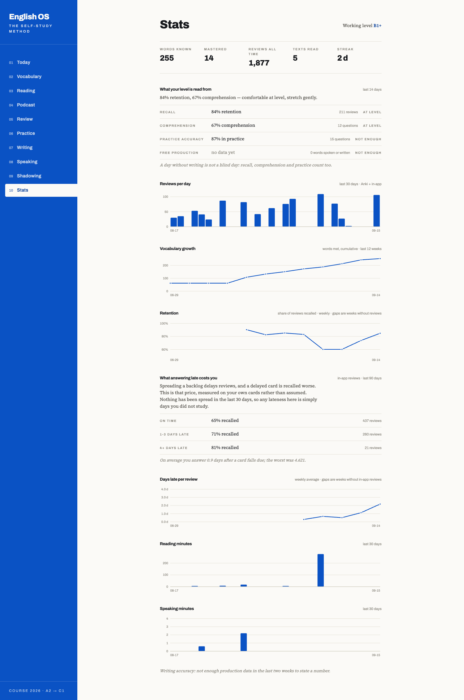

Y dos estados citados arriba:

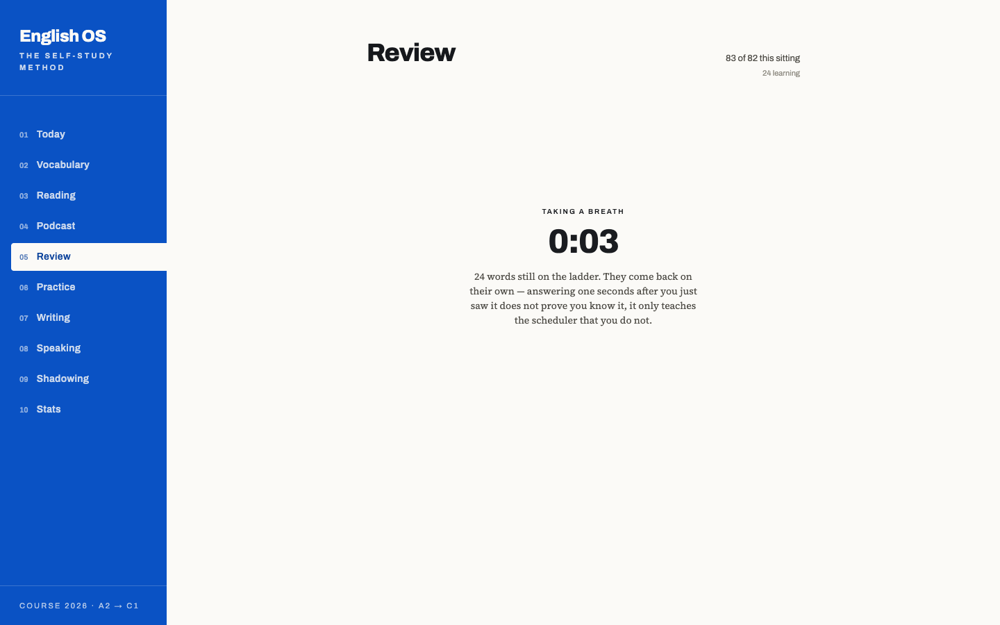
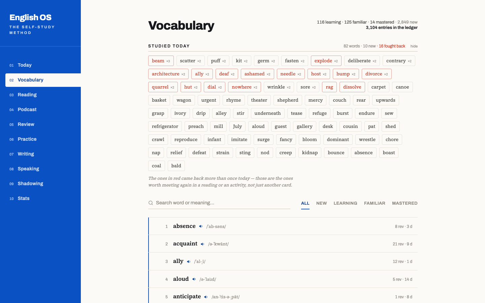
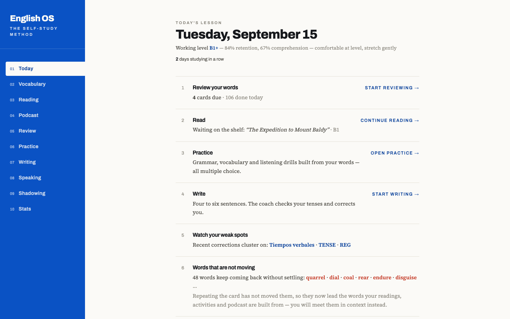

---

## 5. Huecos

| Qué no se evaluó | Por qué |
|---|---|
| Contenido generado por la IA: drill de Practice con preguntas, mensaje guiado real, resultados de Writing y Speaking, resumen de Conversación, explicación ¶ con contenido, grammar tip | La IA se forzó a fallar en el sandbox. Se evaluaron los estados de error y el código. |
| Estado "Writing… / In line" en vivo | Mismo motivo; evaluado por código (`ReadingPage.tsx:171-180`, `PodcastPage.tsx:112-120`). |
| Listen & shadow, Play de Podcast, sesión de Shadowing con audio, spotlight de karaoke | TTS escribiría en el caché real `data/media/tts` y cargaría Kokoro. Solo estado inicial y código. |
| Grabar en Speaking y Conversación, precalentado de conversación | Sin micrófono por regla; `/conversation/warm` bloqueado. |
| Estado de pausa | No se pausó el curso; evaluado por código (`TodayPage.tsx:80-116`, `ReviewPage.tsx:350-363`). |
| Colofón de "Finish reading" y resultado completo del quiz | Solo se respondió una pregunta. |
| `prefers-reduced-motion` en runtime | No existe en el código (0 resultados); no hay nada que probar. |
| Lectores de pantalla reales (VoiceOver) | Solo evidencia estática y de runtime (roles, `aria-*`, orden de Tab). |
| Posible navegación fantasma: `runJob` llama `navigate('/reading/:id')` desde un componente desmontado | Detectado en código, no reproducido. |

---

## 6. Anexos de evidencia medible

### 6.1 Contraste (WCAG 2.x)

| Texto | Paper | Cobalt-wash | Cobalt |
|---|---|---|---|
| ink | 17.03 | 15.96 | 2.55 |
| ink-soft | 8.49 | 7.96 | 1.27 |
| **ghost** | **3.22** | **3.02** | 2.07 |
| ghost al 55 % | **1.79** | — | — |
| cobalt | 6.67 | 6.25 | **1.00** (anillo de foco) |
| cobalt-deep | 9.10 | 8.53 | 1.36 |
| correction | 4.82 | 4.52 | 1.38 |
| paper | — | — | 6.67 |

Casos con opacidad:
- Rail: label inactivo 4.85; número 3.15; footer 4.08.
- Primario `disabled:opacity-40`: 2.16.
- El ghost más claro que llega a 4.5 sobre paper es `#76746C`.

### 6.2 `text-ghost` que hay que leer (82 de 145)

| Tipo | Archivo:línea |
|---|---|
| IPA | `ReviewPage:171`, `WordEntry:84`, `ReaderPage:299` |
| Instrucciones y atajos | `GuidedWriting:144,211`, `PracticePage:249,296`, `ReviewPage:269,661`, `ShadowingPage:295`, `SpeakingPage:146`, `WritingPage:152`, `PodcastPage:357,361`, `ReadingPage:257`, `VocabularyPage:160,272`, `TodayPage:226` |
| Números para decidir | `ReviewPage:648` (intervalo sobre cada rating), `:414`, `:419`, `:424`, `:263` |
| Veredictos y valores | `StatsPage:81,92,175,222`, `WritingPage:227`, `TodayPage:67` |
| Labels de dato | `StatsPage:77,168,236`, `WordEntry:238`, `ReaderPage:455`, `WritingPage:306`, `ReviewPage:472` |
| Controles no seleccionados | `ConversationPanel:223`, `History:54,88`, `PodcastPage:256,295,314,423`, `ReadingPage:230,299,338`, `ReaderPage:195,205,302,344,390`, `ReadingPlayer:127,138`, `SpeakingPage:111,132,202`, `ShadowingPage:228,270,283`, `ReviewPage:450`, `WordEntry:217`, `VocabularyPage:121,242`, `TodayPage:241,266`, `WritingPage:93,122,138` |
| Placeholders | `ReadingPage:211,222`, `VocabularyPage:104`, `TodayPage:254`, `WritingPage:179` |
| Esperas | `ConversationPanel:236`, `PodcastPage:115`, `ReadingPage:174`, `ReaderPage:397`, `ShadowingPage:177` |
| Opciones atenuadas | `ComprehensionQuiz:81`, `PracticePage:246` |
| Español | `GuidedWriting:107`, `WritingPage:351` |

### 6.3 Escala tipográfica: hoy vs propuesta

| Hoy | Usos | → Paso |
|---|---|---|
| 9 px (SVG), 10 px mayúsculas, 11 px mayúsculas | 1 + 52 + parte de 53 | `label` 11/1.2 · 0.16em · Archivo 600 |
| 11 y 12 px minúsculas | parte de 53 + 81 | `meta` 12/1.45 · Archivo 400–500 |
| 11 y 12 px en botones (0.14–0.18em) | — | `action` 12 · 0.14em · Archivo 600 |
| 13 y 14 px Archivo, `text-sm` | 37 + 43 + 7 | `ui` 14/1.4 |
| 13 y 14 px serif | — | `note` 14/1.6 italic |
| 15 y 16 px | 36 + 15 | `body` 16/1.65 |
| 17 px | 5 | `read` 17/1.75 (68ch) |
| 19 px, `lg`, `xl` | 4 + 10 + 5 | `lede` 20/1.4 |
| `2xl`, `3xl` | 6 + 5 | `title` 28/1.2 serif 600 |
| `4xl` | 12 | `h2` 36/1.05 · Archivo 800 tight |
| `5xl` | 4 | `display` 48/1 |

Tracking: de 7 valores (0.12–0.28em) a 3 (0.14 · 0.16 · tight).

### 6.4 Esperas del LLM

| Dónde | Mecanismo | ¿Cola o duración? | ¿Sobrevive a navegar? | Error |
|---|---|---|---|---|
| Reading (generar) | job + sondeo 1.5 s | cola sí · "a moment" | no | "Check the AI setup and try again" (sin botón) |
| Podcast | job + sondeo 1.5 s | cola sí · "a few minutes" | no | "Check the AI and voice setup" |
| Shadowing | sondeo propio 2 s | relativa al vídeo | lo promete, no lo cumple | `job.error` crudo en español |
| Practice | síncrono | skeleton sin texto | — | "Check the AI setup" |
| Writing / guiado | síncrono | skeleton / "Checking…" | no | "check the AI setup in Reading" / "Right as it is" falso |
| Speaking / Conversación | síncrono | skeleton / esperas en español | no | "revisa el modelo en Reading" |
| Reader ¶ | síncrono | "The coach is looking at it…" | — | sin retry |
| TTS | síncrono | "Preparing the voice…" | — | "You can still read on your own" ✓ |

---

## 7. La decisión

### A. Pulir el mundo actual
`polish` · `typeset` · `layout` · `clarify` · `harden`

- **A favor:**
  - Review, Stats y el player de Podcast prueban que el Workbook se ve profesional cuando se ejecuta bien.
  - El detector estático sale limpio: no hay anti-patterns de plantilla.
  - Casi todos los P1 son de ejecución (componentes duplicados, estados, copy).
- **En contra:**
  - Tres problemas **no se arreglan sin tocar el mundo escrito**: el token `ghost` falla AA (hay que partirlo en dos), la regla 10 ya es falsa (10 lecciones planas en orden de roadmap) y la regla 8 nunca contempló el foco sobre el rail.
  - Pulir sin actualizar `DESIGN.md` deja la próxima lección (M23) sin escala ni componentes a los que atenerse, y la deriva vuelve.

### B. Evolucionar el mundo ✅ recomendada
`extract` · `harden` · `layout` · `typeset` · `clarify` · `adapt`

- **A favor:**
  - Conserva lo que funciona (paper, cobalto estructural, dos voces, rules-not-cards, `SLIDE`, la voz editorial).
  - Añade lo que al mundo le falta para una app de 10 módulos con IA lenta:
    - una **escala** tipográfica real;
    - un token de texto **accesible**;
    - **componentes** con nombre;
    - un **rail agrupado** en torno al día;
    - una gramática de **espera y error**;
    - Today como **conductor**.
  - Todo eso queda escrito en `DESIGN.md`, así que el sistema sobrevive al siguiente módulo.
- **En contra:**
  - Más trabajo que A: toca las 10 lecciones y reescribe secciones de `DESIGN.md`.
  - Riesgo de "rediseño por la puerta de atrás" si no se acota a tokens, componentes y navegación.

### C. Rediseñar
`new-work`

- **A favor:**
  - El concepto "curso numerado" encaja mal con un estudio (Podcast, Speaking, Shadowing) y con una app de uso diario no lineal.
  - Un mundo tipo Readwise Reader o LingQ resolvería de raíz la navegación y la densidad del Reader.
- **En contra:**
  - Ningún hallazgo del top 10 lo exige.
  - Los 5 problemas de mayor impacto en el hábito (material invisible, Today, esperas, errores, módulos fuera del sistema) persistirían en cualquier mundo nuevo, porque son de estado y consistencia, no de estética.
  - Tiraría lo mejor evaluado (Review 19/24).
  - Costo L+ sin retorno en el hábito.

**Recomendación: B.** El problema no es el mundo, pero el mundo escrito se quedó en 6 lecciones y sin sistema. Hay que evolucionarlo lo justo (tokens, escala, componentes, rail, estados) y ejecutar consistentemente encima.

### Plan por fases (opción B)

| Fase | Comando | Lecciones | Qué hace | Terminado cuando |
|---|---|---|---|---|
| 1 | `/impeccable extract` | todas | Primitivas `Page`, `PageHeader`, `Button` (primary/secondary/text), `Choice`, `Section`, `RuledSkeleton`, `ErrorLine`, `Waiting` y `motion.ts` con `SLIDE`. Documentarlas en `DESIGN.md` ("Components"). | ≤3 variantes de botón en `src`; un solo contenedor de página por tipo (estudio / evidencia); 0 skeletons de bloque gris; `SLIDE` fuera de `VocabularyPage` |
| 2 | `/impeccable harden` | 01, 03, 04, 05, 06, 07, 08, 09 | Estado del material al cerrar la sentada; `<Waiting>` reenganchable desde `/api/jobs` con tiempo transcurrido; `ErrorLine` con Try again y causa real; guiado honesto ("Not checked") que conserva las oraciones; `aria-live`; `reducedMotion`. | Cerrar una sentada con la IA caída muestra el fallo y Retry; navegar y volver durante una generación mantiene la espera; 0 "check the AI setup in Reading"; `GuidedWriting` nunca muestra "Right" sin verificar |
| 3 | `/impeccable layout` | 01 Today, 05 Review (cierre), rail | Today como conductor: un primario, estados ready/queued/done/failed, estimado total. Close → Today. Rail en tres grupos (The day / Studio / Ledger) con numeración del día; auto-scroll del activo a <lg. Reescribir la regla 10 de `DESIGN.md`. | Desde Today la primera acción es un solo botón obvio; tras la sentada Today muestra ✓ en Review y el estado del material; a 390 px la lección activa siempre está visible |
| 4 | `/impeccable typeset` | todas | Escala de 10 pasos en `@theme`; partir `ghost` en `ghost-ink` (#76746C) y `ghost-mark`; foco `paper` en el rail; mínimos de 11 px texto / 10 px ejes; 68ch en las notas de Stats. Actualizar Tokens y Type en `DESIGN.md`. | 0 `text-[Npx]` en `src`; detector en navegador con 0 low-contrast y 0 undersized en Today, Review, Reader, Stats y Vocabulary; foco visible en el rail |
| 5 | `/impeccable clarify` | 08 Speaking, 09 Shadowing, 01, 07, 10 | Interfaz en inglés; español tras Uncover o con `lang="es"`; ✗/✓ en Conversación; copy obsoleto ("Four to six sentences", "Anki + in-app", "Ease", "4.621", "0 cards"); títulos de documento por lección. | 0 texto de interfaz en español fuera de `lang="es"`; grep de los strings obsoletos = 0 |
| 6 | `/impeccable adapt` + `distill` | 03 Reader, 02 Vocabulary | Tinta solo en LEARNING y stuck con toggle "Show all marks"; ¶ con foco y touch, aside en contexto; significado on demand de las desconocidas; roving tabindex; "Studied today" colapsado sin chips; botones no anidados; rutas `/podcast/:id` y `/shadowing/:id`. | En la lectura del día <15 palabras con tinta por defecto; ¶ alcanzable con teclado y a 390 px; 0 `button` dentro de `button` |
| 7 | `/impeccable audit` → `/impeccable polish` → `/impeccable critique` | todas | Pasada técnica final y re-crítica con el mismo sandbox. | Nielsen ≥28/40 (Good); ninguna lección por debajo de 14/24 en el scorecard; 0 P0/P1 abiertos |

Orden: 1 antes que 2–6, porque los demás consumen las primitivas. La fase 2 es la de mayor retorno para el hábito; si hace falta un quick win antes, su parte de "cierre de sentada + Today muestra el material" se puede adelantar sin esperar a la fase 1.

---

**Decisión (Eddie, 2026-09-15): B — evolucionar el mundo. Se arranca por la fase 1 (`/impeccable extract`).**
